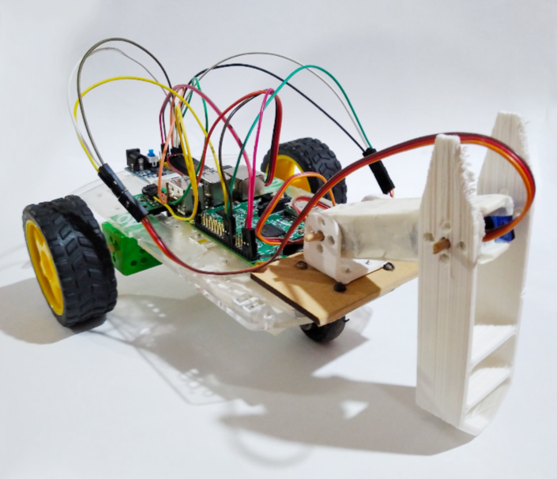
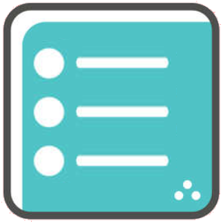
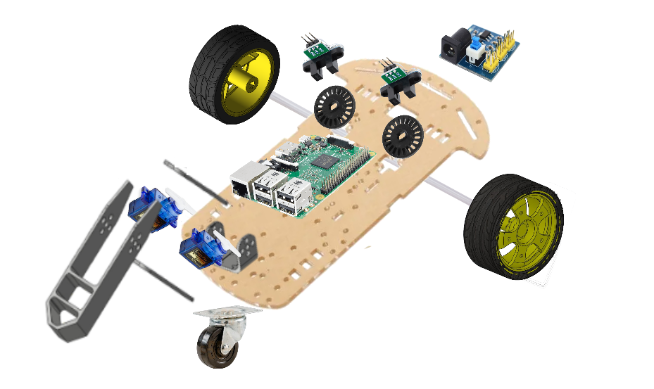
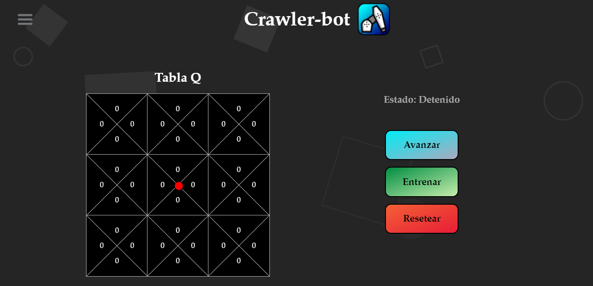
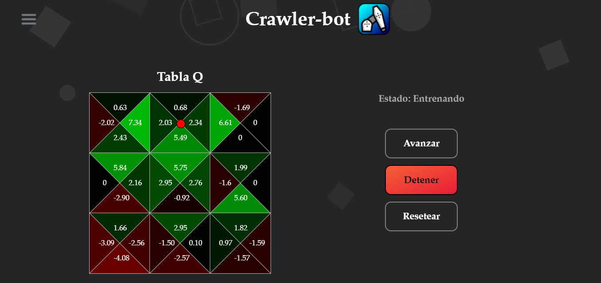
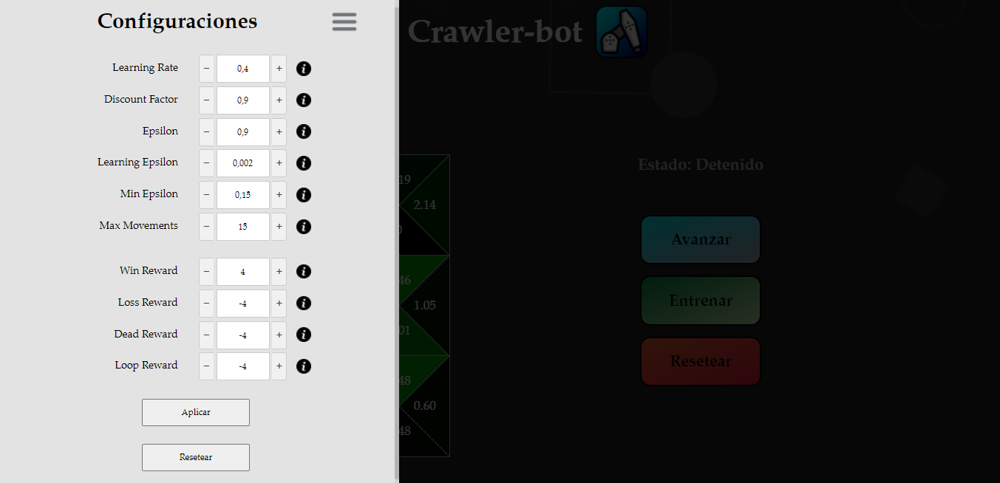

<!-- <p align="center">
  
  <br>
  <br>
</p>

<h1 align="center"> Proyecto C1 - Robot Crawler - Taller de Proyecto II </h1> -->

<div align="center">
  
  <br>
  <h2> Proyecto C1: Robot Crawler - Taller de Proyecto II - UNLP </h2>
</div>

<div align="center">
  <h4><strong>Robot Crawler controlado por Raspberry Pi, capaz de aprender a desplazarse.</strong></h4>

  <a href="https://github.com/flemingmartin/crawler-bot"></a>
</div>

<br>

En este repositorio, se encuentra el trabajo realizado en el transcurso de la materia **Taller de Proyecto II**, perteneciente a la carrera [**Ingeniería en Computación**](http://ic.info.unlp.edu.ar/) de la [**Universidad Nacional de La Plata**](https://unlp.edu.ar/), durante el año 2021. 
El mismo consiste en un **Robot Crawler** que aprende a desplazarse utilizando un brazo robótico con dos grados de libertad mediante el algoritmo de aprendizaje automático reforzado **Q-Learning**.

<p align="center">  </p>

## Table de Contenidos  <A NAME="tabla-de-contenidos"></A>
1. [Comenzando](#comenzando)
2. [Pre-Requisitos](#pre-requisitos)
3. [Instalación](#instalacion)
4. [Ejecución](#ejecucion)
5. [Interfaz Web](#interfaz-web)
6. [Robot en Funcionamiento](#robot-en-funcionamiento)
7. [Herramientas](#herramientas)
8. [Autores](#autores)
9. [Contacto](#contacto)

## Comenzando 🚀 <A NAME="comenzando"></A>

Si bien el programa puede ser ejecutado desde una computadora de uso personal, como si de una simulación se tratase, 
el código de la aplicación se encuentra diseñado para la administración de un robot Crawler controlado por una Raspberry Pi.

Ver [**Ejecución**](#ejecucion) para conocer cómo desplegar el proyecto.

### Pre-Requisitos 📋 <A NAME="pre-requisitos"></A>

A continuación se listan los componentes con los que se deberá contar para la construcción del robot Crawler:

<table>
  <tr>
    <th>Ítem</th>
    <th>Nombre</th>
    <th>Descripción</th>
    <th>#</th>
  </tr>
  <tr>
    <td align="center">1</td> <td>Raspberry Pi 3 B+</td> <td>Lógica del programa y servidor.</td> <td align="center">1</td>
  </tr>
  <tr>
    <td align="center">2</td> <td>Encoders HC-020K</td> <td>Mide la rotación de las ruedas (movimiento del robot).</td> <td align="center">2</td>
  </tr>
  <tr>
    <td align="center">3</td> <td>Servomotores SG90</td> <td>Articulaciones del brazo robótico.</td> <td align="center">2</td>
  </tr>
  <tr>
    <td align="center">4</td> <td>Impresión 3D del Brazo</td> <td>Esqueleto del brazo robótico.</td> <td align="center">1</td>
  </tr>
  <tr>
    <td align="center">5</td> <td>Ruedas de Goma</td> <td>Ayudan al desplazamiento.</td> <td align="center">2</td>
  </tr>
  <tr>
    <td align="center">6</td> <td>Rueda Ranurada</td> <td>Permite estabilizar al robot.</td> <td align="center">1</td>
  </tr>
  <tr>
    <td align="center">7</td> <td>Fuente Switching 5V 3A</td> <td>Alimentación del sistema.</td> <td align="center">1</td>
  </tr>
  <tr>
    <td align="center">8</td> <td>Placa de Alimentación QYF-DY02</td> <td>Provee múltiples niveles de tensión para alimentar los diferentes dispositivos.</td> <td align="center">1</td>
  </tr>
  <tr>
    <td align="center">9</td> <td>Pendrive 32GB</td> <td>Almacenamiento del SO, los archivos de programa, la base de datos y el servidor.</td> <td align="center">1</td>
  </tr>
  <tr>
    <td align="center">10</td> <td>Kit de Cables Dupont</td> <td>Kit de cables dupont macho-hembra, macho-macho y hembra-hembra.</td> <td align="center">1</td>
  </tr>

</table>

Una vez obtenidos los elementos necesarios, se debe construir el Robot siguiendo el diagrama de ensamblado mostrado a continuación:

<p align="center">  </p>


### Instalación 🔧 <A NAME="instalacion"></A>

Para poder cargar el proyecto en una Raspberry Pi (o ejecutar el programa en una computadora personal), en primer lugar se deberá clonar el repositorio en el dispositivo. 
Por ejemplo, si se clona utilizando SSH:

```
> git clone git@github.com:flemingmartin/crawler-bot.git
```

Se deberá contar con el interprete de Python 3 instalado en el equipo y las librerías de este lenguaje que se listan a continuación (junto a las versiones utilizadas en este proyecto):
* Numpy:1.19.5 - Da soporte para crear vectores y matrices grandes multidimensionales
* Jyserver:0.0.5 - Utilizado para la creacion de interfaces dinámicas, provee acceso al DOM del navegador y al Javascript usando sintaxis de Python.
* Flask:1.1.1 - Framework minimalista que permite crear aplicaciones web rápidamente con un mínimo número de líneas de código.
* SQLAlchemy:.3.13 - Es un _Object-Relational Mapper / Mapping-tool (ORM)_. Provee funciones para la creación y utilización de bases de datos sin la necesidad de usar SQL
* Flask-SQLAlchemy:2.5.1 - Extensión para Flask que agrega compatibilidad con SQLAlchemy a la aplicación. 
* pigpio:79 - Permite el control de los puertos de entrada/salidas de propósito general (GPIO).

Muchas de estas bibliotecas son instalables mediante el instalador de Python, utilizando la instrucción ```pip3 install```. 
A continuación los comandos a ejecutar para la instalación:

```
> pip3 install jyserver Flask SQLAlchemy Flask-SQLAlchemy
> sudo apt install python3-numpy    # no instalada con pip debido a problemas en la instalación detectados en el desarrollo
> sudo apt-get install pigpio python-pigpio python3-pigpio
```

_**Aclaración**: El módulo pigpio cuenta con un demonio encargado del control de los puertos GPIO de la Raspberry Pi, la biblioteca de Python ofrece comunicación con dicho demonio. 
Es recomendable agregar la inicialización del demonio en el arranque del sistema. Además, es posible incluir la creación del servidor Flask, con el objetivo de no tener que ejecutar ambos comandos de manera remota.
Para ello, se debe agregar en el archivo **/etc/rc.local** las siguientes instrucciones:_
```
pigpiod   # Inicialización del demonio pigpio
su pi -c 'python3 app.py' # Ejecución del programa principal, éste levanta el servidor Flask
```

## Ejecución 🤖 <A NAME="ejecucion"></A>

Si se ha incorporado en el arranque del sistema las instrucciones de iniciación del demonio _pigpio_ y de creación del servidor Flask, solo resta acceder desde el navegador a la aplicación web introduciendo ```http://192.168.4.1:5000/``` en la barra de direcciones.

En el caso de que no haber inlcuido dichas instrucciones en el arranque, para poder ejecutar la aplicación, se deberá conectar a la Raspberry Pi mediante protocolo _ssh_ y ejecutar las instrucciones que se muestran a continuación:
```
> sudo pigpiod    # Inicialización del demonio pigpio
> python3 app.py  # Ejecución del programa principal, éste levanta el servidor Flask
```

_**Aclaraciones**:_ 
* _Si únicamente se pretende probar el método de entrenamiento a modo de simulación en una PC (utilizando valores aleatorios como lecturas de los sensores), 
debe dirigirse a **/python_code/robot.py** y modificar la variable **_raspi** de la siguiente manera: ```_raspi = False```. 
De este modo, indica al sistema que no debe controlar puertos de entrada/salida, por lo que no se utilizarán las funciones propias del hardware del Robot._

* _Por otro lado, si se ejecuta la aplicación en la Raspberry Pi, es posible configurar que el servidor sea creado en la red local a la cual se encuentra conectada la Raspberry Pi
o en la red generada por ésta si se utiliza como Access Point (en nuestro caso obtiene como dirección IP ```192.168.4.1```). Esta configuración puede ser seteada en el archivo **/app.py**,
a partir de la variable **_dev**, la cual se deberá setear ```_dev = False``` para determinar que se ejecute en "producción" en la red creada como Access Point
o ```_dev = True``` si se desea levantar el servidor en la red local a la que se encuentra conectada (por ejemplo, por Ethernet)._


### Interfaz Web 💻 <A NAME="interfaz-web"></A>

La aplicación cuenta con una interfaz web, desde la cual es posible ejecutar las tareas que el Crawler puede realizar: Caminar (mediante el botón _Avanzar_) y Aprender a caminar (mediante el botón _Entrenar_).
<p align="center">  </p>

A medida que el robot ejecuta su entrenamiento, se pueden visualizar tanto los cambios realizados en la Tabla Q, como el estado en el que el robot se encuentra (representado por el punto rojo de la tabla). 
Mientras que durante la caminata, se puede ver cómo se realizan los cambios de estado en función de los valores de la tabla con mayor recompensa entrenada.
<p align="center">  </p>

Además, la interfaz permite actualizar los parámetros de entrenamiento, mediante un menú de configuración.
<p align="center">  </p>


### Robot en Funcionamiento 💪 <A NAME="robot-en-funcionamiento"></A>

**Crawler Aprendiendo a Caminar**: En el siguiente video se puede observar al robot realizando una exploración de los movimientos disponibles, siguiendo la ejecución del algoritmo de aprendizaje reforzado Q-Learning. De esta manera, va actualizando los pesos de la Tabla Q en función de la obtención de recompensas (provenientes de la lectura de los encoders).

<p align="center">  </p>


**Crawler Caminando**: A continuación se puede observar la manera en el que robot puede desplazarse utilizando su brazo, una vez que ya ha sido entrenado. Para ello, utiliza los valores de la Tabla Q que indicará cuáles son las acciones que deberá hacer en cada momento para cumplir con su objetivo.

<p align="center">  </p>

## Herramientas 🛠️ <A NAME="herramientas"></A>

Herramientas utilizadas en este proyecto: 

* [Raspberry Pi](https://www.raspberrypi.org/) - Placa de desarrollo
* [Python](https://www.python.org/) - Lenguaje de programación principal
* [Flask](https://flask.palletsprojects.com/) - Framework de desarrollo web
* [SQLAlchemy](https://www.sqlalchemy.org/) - Gestión de la base de datos
* [Jyserver](https://github.com/ftrias/jyserver) - Acceso al DOM y javascript desde Python
* [jQuery](https://jquery.com/) - Librería Javascript


<!-- ## Wiki 📖

Puedes encontrar mucho más de cómo utilizar este proyecto en nuestra [Wiki](https://github.com/tu/proyecto/wiki) 

-->


<!-- ## Versionado 📌

Usamos [SemVer](http://semver.org/) para el versionado. Para todas las versiones disponibles, mira los [tags en este repositorio](https://github.com/tu/proyecto/tags). 

-->

## Autores ✒️ <A NAME="autores"></A>

* **Fleming, Martín** - [GitHub](https://github.com/flemingmartin/)
* **Morales, Hernán Sergio** - [GitLab](https://gitlab.com/hernansergiomorales)
* **Saavedra, Marcos David** - [GitHub](https://github.com/saavedramarcosdavid)

<!-- ## Licencia 📄

Este proyecto está bajo la Licencia (Tu Licencia) - mira el archivo [LICENSE.md](LICENSE.md) para detalles

 -->

## Contacto 🎁 <A NAME="contacto"></A>

Si tiene alguna pregunta o sugerencia, no dude en contactar a cualquier miembro del equipo

¡Muchas gracias por ver nuestro repositorio! 

<h4 align="right"> El equipo del Proyecto C1. </h4>

